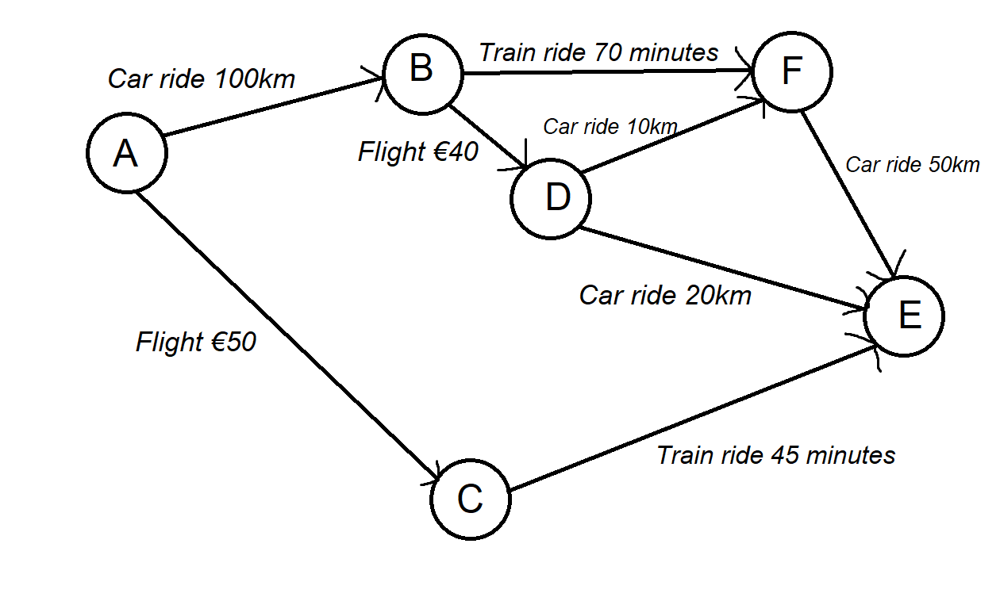

# Dijkstra Shortest Path & Datastructures

AI school assignment for HU (Hogeschool Utrecht).

#### Implement an OO Dijkstra algorithm using a PriorityQueue.

## Dijkstra
I based the code on [this article on Baeldung](https://www.baeldung.com/java-dijkstra).
It explains the algorithm very well and a Priority Queue is easily implementable. The article explains the algorithm
fairly well, so I will not explain the working of it here. However, I will note down the changes I made according to
the school assignment.

## Classes
### Travel_Method:
I turned Vlucht, Rit and Trein into one class, and used a `multiplier` to tell them apart and to make them easily
comparable to each other. E.g. A ticket for a flight from Schiphol Airport to Heathrow Airport is about €120.
This flight is about 370 kilometers, 370 / 120 ≈ 3, this is how I came up with the multipliers. I did the same for
train rides except I switched ticket price for time. The average speed of a train in the Netherlands is about 130km/h.
So the multiplier for train rides is 1,3.

### Main
I start with creating the three different `Travel_Method`s; "car ride", "train ride", and "flight". After this I
create instances of Node and name them from "A" to "F".

### My graph:

